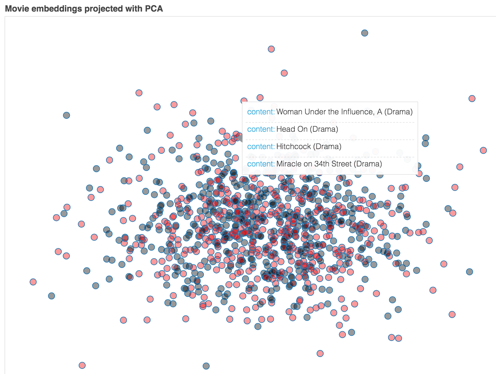
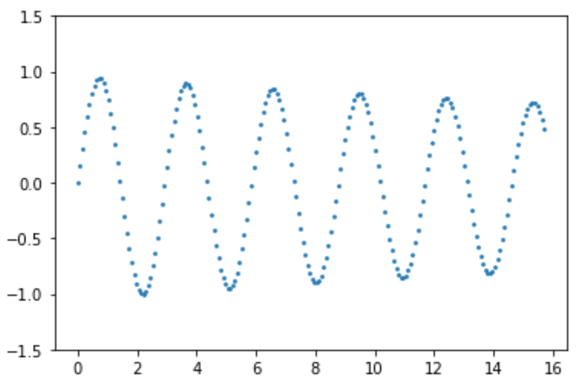

# Exploring deep learning neural networks

This repository is just a collection of notebooks that I'm using to explore various deep learning (DL) concepts and APIs (such as keras).  The mathematics behind the networks is straightforward but tedious so I'm focusing on applying networks.

## AWS stuff

* [Remote jupyter lab access](aws-setup.md)

## Deep learning image classification

Previously I tried DL for regression on some tabular data, but it struggles to keep up with the simple random forest. DL shines with unstructured data so I turned to the standard hello world of MNIST classification:

* [MNIST with a vanilla network](notebooks/mnist-vanilla.ipynb)
* [MNIST using convolutional network](notebooks/mnist-CNN.ipynb)

## Text processing

The next step is to play around with tokenizing text and representing words and documents with sparse work vectors:

* [Text tokenization, word indexing, word vectors](notebooks/word-vectors.ipynb)
* [Dense but random word vectors](notebooks/dense-random-embeddings.ipynb)

## Categorical variable embedding

Before jumping into dense word vectors, I wanted to explore the whole embedding mechanism using some simple categorical variables. Before using the built-in embedding layer with keras, I wanted to build some examples manually.
 
* [Manual movie embeddings via movie+user->rating](notebooks/catvar-embeddings-homebrew.ipynb) (Got ok but not great results here.)
* [Separate layers for movie and user IDs joined into a DL pipeline](notebooks/catvar-embeddings-split-homebrew.ipynb) (Got good results here.)
* [Keras embeddings via movie+user->rating](notebooks/catvar-embeddings-keras.ipynb) (slightly older than the previous two now.)

* [Word embeddings using Keras](notebooks/word-embeddings-keras.ipynb)

## PyTorch

PyTorch seems a bit more low-level but it's very cool and easy to use. It is essentially a numpy with automatic differentiation package, but also includes a `torch.nn` layer that looks very much like Keras. First, I went through some exercises following their tutorial to get use to the library and how to use the auto differentiation:

* [Gradient descent in pytorch](notebooks/pytorch-gradient-descent.ipynb)

Now, I've had some very good luck building my own collaborative filtering mechanism using my own gradient descent with momentum in raw pytorch. I am more or less able to get the same predictive ability using matrix factorization that I did with the deep learning version above. Implemented gradient descent with momentum and then full AdaGrad.  Didn't do any minibatching.

* [Collaborative filtering with pytorch](notebooks/collaborative-filtering.ipynb) (Cool. learned to display interactive graphs with [bokeh](https://docs.bokeh.org/en/latest/index.html) too!) 

I'm going to start again on collaborative filtering with pytorch: [Regularized collaborative filtering with pytorch](notebooks/collaborative-filtering-regularized.ipynb). **Lessons:**

* I was only tracking the training error, which I could get pretty low but then I was wondering why the validation error using a random forest OOB (user+movie->rating) often was not good. Duh.  I'm watching the training error inside the training loop, not the validation error.
* Ollie just said: "*...it depends on what you are looking for. Embeddings as first step or embeddings or a means of reducing dimensions. First one is validation, second is training error and even not using any validation or test at all.*"
* By randomly selecting validation and training sets at each iteration (epoch), we are moving to stochastic gradient descent (SGD). Previously I only used gradient descent.
* I could not get the bias version working well. Yannet pointed out that I need to initialize my randomized weights so that the predicted rating has an average of 2.5 or somewhere else between zero and five. Initialization does after all seem to make a difference, in both training and validation error.
* Adding bias dramatically slowed the training process down! Way more than I would expect, given the small increase in data and operations. 
* I also noticed that Jeremy/Sylvain does L2 regularization in their book, which clued me in to the fact that validation error is important. We don't want those coefficients getting too big as they are likely chasing something in the training set.
* I also found that simple gradient descent with momentum did a pretty good job and I didn't need the complexity of AdaGrad.
* Another trick from fastai book is to keep the predicted rating in the range 0..5, which constrains where the loss function can send gradient descent.

Dang.  I still don't think I'm getting a good result and it is likely my simple gradient descent mechanism.  I'm going to try this over again using the built-in pytorch optimizers. Ha. was most likely incorrect assessment and display issues with indexing. All is well now:

* [Collaborative filtering with pytorch optimizers](notebooks/collaborative-filtering-pytorch-optimizers.ipynb)

## Text processing w/o RNNs

I'm going to try working through the keras book examples using pytorch:

* [IMDB using pytorch and embeddings](imdb-sentiment-pytorch.ipynb)

oooook. It turns out I was using just 1000 training and 1000 testing records but Keras was using a much bigger data set with 25,000 records each. I can then using my PyTorch methods get roughly the same 75% accuracy from the Keras book. I redid everything in this notebook:

* [IMDB using pytorch but keras to load data](imdb-pytorch-keras-data.ipynb)

## Recurrent neural networks

* [Playing with linear algebra for neural nets](https://github.com/parrt/playdl/blob/master/notebooks/matrices.ipynb) Just playing with matrix dimensions so far
* [Numpy only for forward step of RNN](https://github.com/parrt/playdl/blob/master/notebooks/RNN-numpy.ipynb)
* [RNN using tensors not neuron layers; predicts sin(y)](https://github.com/parrt/playdl/blob/master/notebooks/RNN-sine.ipynb): 

* [RNN for last name -> language classification](https://github.com/parrt/playdl/blob/master/notebooks/RNN-lastname.ipynb) Three ways: record-by-record, all records' jth char vec at once using raw matrices, again using torch.nn layers.

## Generating text

* [LSTM for last name -> language classification](https://github.com/parrt/playdl/blob/master/notebooks/LSTM-lastname.ipynb) (using torch nn layers)
* [Same LSTM using Keras](notebooks/LSTM-lastname-keras.ipynb)
* [Playing with fastai sample data](notebooks/LSTM-fastai-data.ipynb)
* [Try to generate Federalist papers like text](notebooks/LSTM-generate.ipynb)
* [Keras: LSTM for last name -> language classification](notebooks/LSTM-lastname-keras.ipynb)
* [LSTM for last name -> language classification](notebooks/LSTM-generate-chars.ipynb)

Ok, starting again using simple RNN using matrix alg from my article.

* [Generate lastnames for specific language](notebooks/RNN-generate-lastname.ipynb)
* [Generate obama speeches](notebooks/RNN-generate-obama.ipynb) This works but the hidden state is reset at the start of every small chunk in order to get truncated back propagation.
* [Generate obama speeches, truncated backpropagation](notebooks/RNN-generate-bptt-obama.ipynb) This version attempts to  divide up the entire text into chunks and then use a single batch containing all chunks. Then inside the training loop I can occasionally wipe out the gradient but keep the hidden state accumulating.
* [Generate obama speeches, add embedding layer](notebooks/RNN-generate-embedding-obama.ipynb) Adding embedding of chars before RNN helps. make len(vocab)->small embedding like 20 squeezes into more meaningful embedding than one of size len(vocab).

## Lessons

Some notes beyond what is in the notebooks

* the role of a neuron or layer is fluid. the output of a layer could be the probability of class k but, if we add a further layer, it could become a feature that helps the new layer predict features.
* relu for RNN also works, not just tanh for obama speeches. use 0 bias, identity for W. clip gradient values to 1.0. Must use `F.cross_entropy()` which combines softmax with that. much better numerical characteristics. Otherwise get NaN immediately.  Clipping isn't required it seems but improves convergence. Seems to tolerate higher learning rate. Can't see to get relu version to match final accuracy score of tanh.
